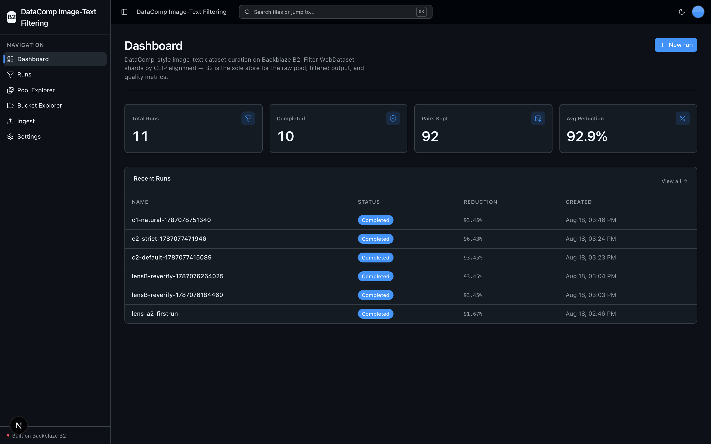
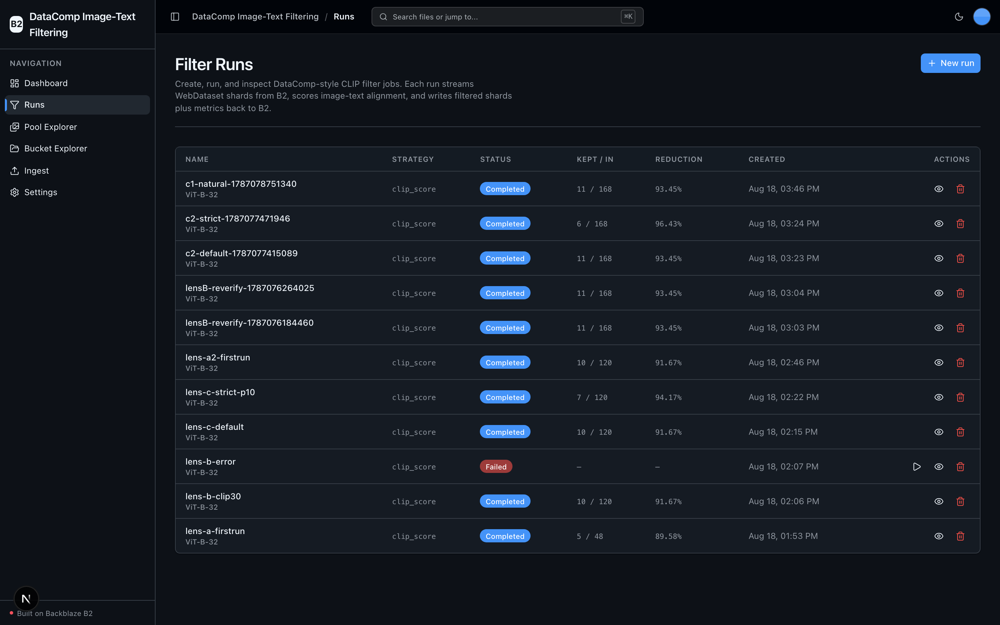
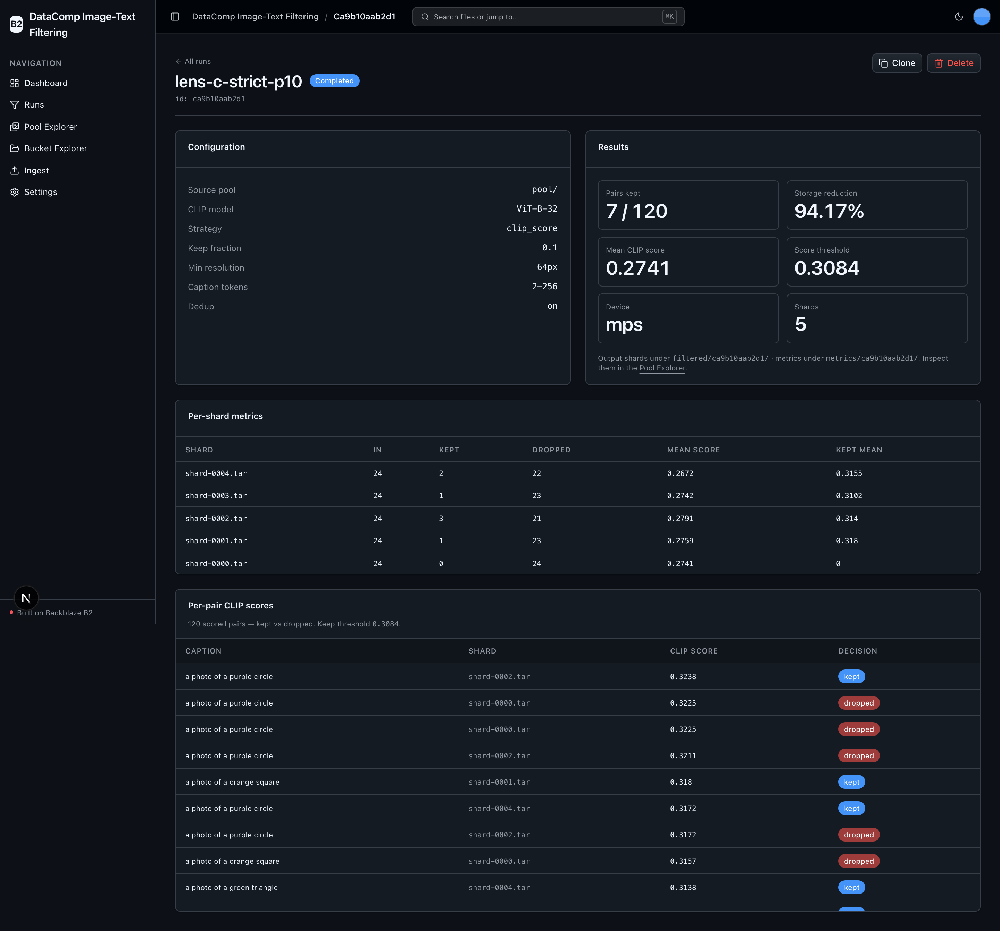
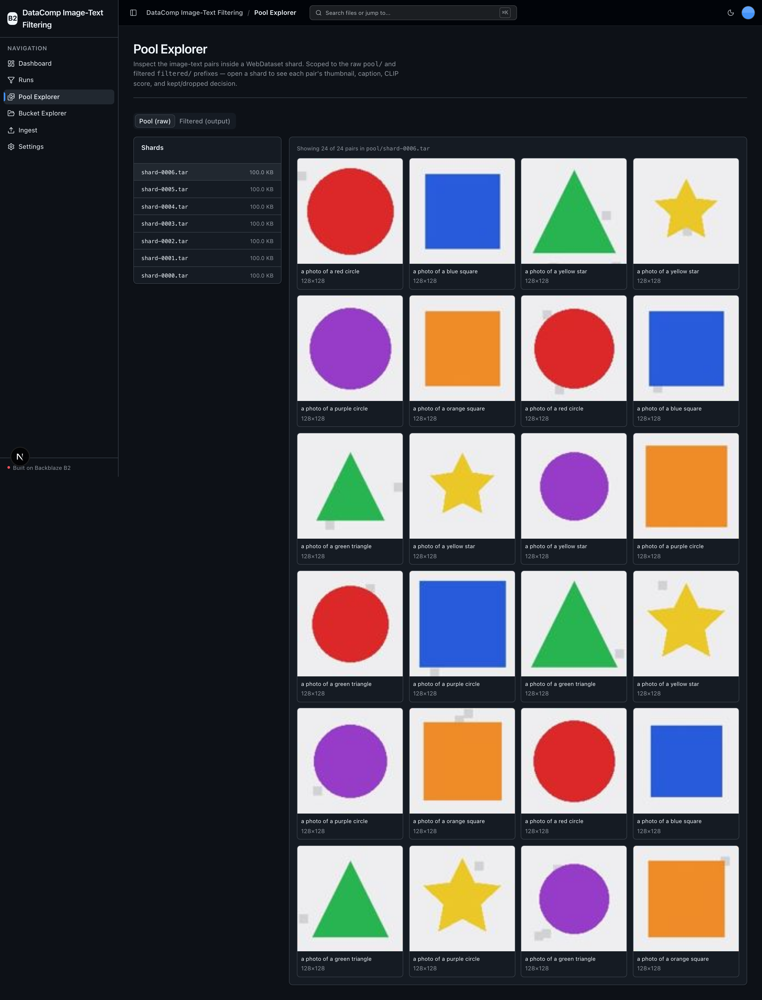
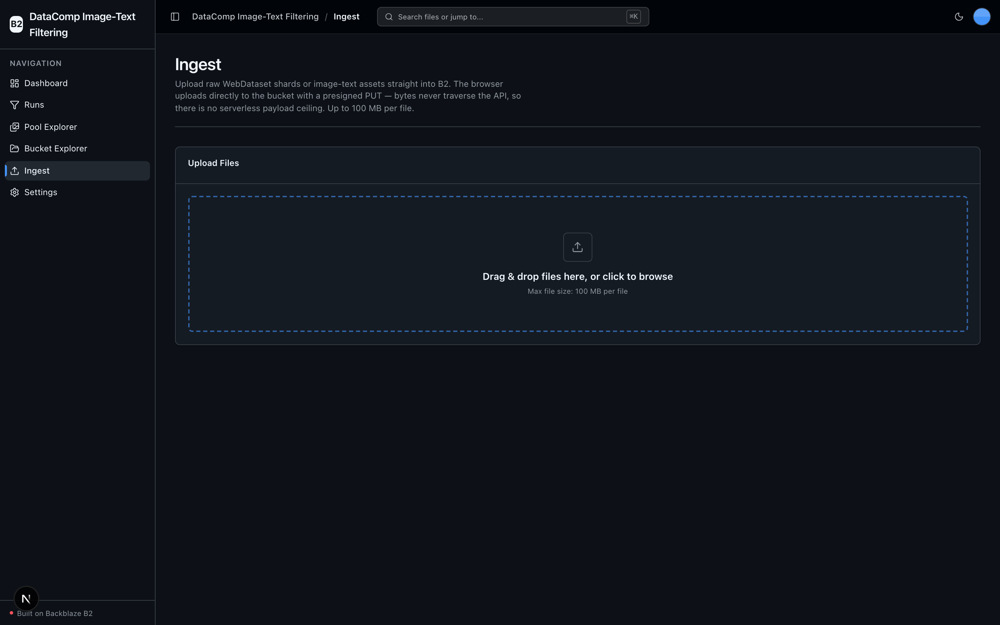

<!-- last_verified: 2026-08-18 -->
# DataComp Image-Text Filtering

Curate billion-scale image-text datasets for vision-language pretraining with **[Backblaze B2](https://www.backblaze.com/sign-up/ai-cloud-storage?utm_source=github&utm_medium=referral&utm_campaign=ai_artifacts&utm_content=b2ai-datacomp-image-text-filtering)** as the sole storage layer. This is a working implementation of the [DataComp](https://github.com/mlfoundations/datacomp) filtering workflow: raw web-scraped image-text pairs live in B2 as WebDataset `.tar` shards, a configurable pipeline streams those shards from B2, scores image-text alignment with **CLIP** (via [`open_clip`](https://github.com/mlfoundations/open_clip)), re-packs the passing pairs into new shards under `filtered/`, and writes per-shard quality metrics as JSON under `metrics/` — all over the S3-compatible API, no local staging, no second API key.

The point: you filter a noisy pool down to high-quality shards **without pulling it locally**, and the filtered output streams straight back to training jobs from B2.

- **Full-stack**: Next.js 16 + React 19 + Tailwind v4 + shadcn/ui frontend, FastAPI backend with a strict layered architecture.
- **B2 is the only store** — the raw pool, filtered output, run manifests, and metrics are all objects in one bucket. No database.
- **Runs on-device** — CLIP scoring runs locally (CPU by default, CUDA/Apple MPS auto-detected). $0 in external API cost; only your B2 credentials.

## What it looks like

**Dashboard** — filter-run totals, pairs kept, and average storage reduction, over a table of the most recent runs.



**Filter Runs** — every CLIP filter job with its strategy, status, kept/in counts, and reduction, plus the full create/run/delete lifecycle.



**Run detail** — a completed run's configuration and results alongside per-shard metrics and the per-pair CLIP scores with kept/dropped decisions.



**Pool Explorer** — open a WebDataset shard to inspect the image-text pairs inside it: thumbnail, caption, and resolution.



**Ingest** — upload raw WebDataset shards or image-text assets straight into B2 with a presigned, direct-to-bucket PUT.



## Quick Start

You need: Node.js ≥ 20, pnpm ≥ 9, Python ≥ 3.12, and a free **[Backblaze B2 account](https://www.backblaze.com/sign-up/ai-cloud-storage?utm_source=github&utm_medium=referral&utm_campaign=ai_artifacts&utm_content=b2ai-datacomp-image-text-filtering)**.

```bash
# 1. Install deps, create the Python venv, copy .env.example -> .env
pnpm run setup

# 2. Fill in your B2 credentials (see the env table below)
#    edit .env

# 3. Seed a small synthetic image-text pool into B2 (keyless, no download)
services/api/.venv/bin/python services/api/scripts/seed_pool.py

# 4. Install the heavy ML stack (torch/open_clip/webdataset) — needed to RUN a
#    filter. It is deliberately excluded from `pnpm run setup` and CI.
services/api/.venv/bin/pip install -r services/api/requirements-ml.txt

# 5. Start the app, then create + run a Filter Run in the UI
pnpm dev
```

Open http://localhost:3000, go to **Runs → New run**, accept the defaults, **Start** the run, then open the **Pool Explorer** to see which pairs were kept vs dropped and why.

> Use `http://localhost:3000` (not `127.0.0.1`) — dev CORS is scoped to the `localhost` origin.

## How it works — the 5-step workflow

1. **Ingest** — raw image-text pairs land in B2 as WebDataset `.tar` shards under `pool/` (the seed script generates a synthetic pool; the Ingest page uploads your own via presigned direct-to-B2 PUT).
2. **Filter** — a Filter Run streams each `pool/` shard from B2 and scores every image-text pair with CLIP.
3. **Write** — passing pairs are re-packed into `filtered/<run>/*.tar` and written back to B2.
4. **Score** — per-shard quality metrics (kept/dropped counts, mean CLIP score, threshold) are written as `metrics/<run>/*.json`, and the run manifest at `runs/<id>/manifest.json`.
5. **Serve** — filtered shards stream straight back to training jobs from B2, in the same WebDataset format.

## Features

- **DataComp-style CLIP-score filtering** — stream shards from B2, score image-text alignment with CLIP, keep the top-percentile pairs (DataComp's `clip_score` baseline).
- **Configurable baseline filters** — CLIP-score percentile, min image resolution, caption-length bounds, and near-duplicate removal — the `clip_score` / `basic` / `image_based` / `text_based` families from DataComp `baselines.py`, chosen on the Run form.
- **Filter Runs, full lifecycle in the UI** — create, read, edit (pending), delete, and run. B2 manifests are the sole store; no database.
- **Pool Explorer** — open a shard to inspect the image-text pairs inside it: thumbnail + caption + CLIP score + kept/dropped. Scoped to `pool/` and `filtered/`.
- **Bucket Explorer** — browse every object in the bucket (pool, filtered, manifests, metrics) with preview/download/delete.

See [docs/features/](docs/features/) for per-feature detail.

## Environment variables

`pnpm run setup` copies `.env.example` to `.env`. Fill in these (from your B2 bucket + application key):

| Variable | Required | What it is |
|---|---|---|
| `B2_APPLICATION_KEY_ID` | yes | B2 application key ID (the S3 access key ID) |
| `B2_APPLICATION_KEY` | yes | B2 application key (the S3 secret) |
| `B2_BUCKET_NAME` | yes | Bucket that holds the pool + filtered output |
| `B2_REGION` | yes | Region slug, e.g. `us-west-004`. The S3 endpoint is built at runtime as `https://s3.<B2_REGION>.backblazeb2.com` — no region is hardcoded anywhere |
| `B2_PUBLIC_URL_BASE` | no | Public base URL for a public bucket (builds direct object URLs). Leave unset for a private bucket |

The application key needs `listBuckets`, `listFiles`, `readFiles`, `writeFiles`, and `deleteFiles`.

## The CLIP filter engine

- **Model**: `open_clip` OpenAI CLIP `ViT-B-32` (pretrained `openai`) by default, selectable up to `ViT-L-14`. Weights are **ungated and keyless** — downloaded once (~350 MB for ViT-B-32) from open_clip's own hosting. No Hugging Face token, no gated terms.
- **Device**: auto-detected at runtime — CUDA → Apple MPS → CPU, defaulting to CPU. Never hard-requires a GPU.
- **Dependency split**: the heavy stack (`torch` / `torchvision` / `open_clip_torch` / `webdataset`) lives in `services/api/requirements-ml.txt`, excluded from `pnpm run setup` and CI so the app boots and every static gate passes ML-free. `service/filtering.py` lazy-imports it; if it is absent, a run is persisted as `failed` with an actionable message (the POST never 500s).

## Commands

```bash
pnpm run setup         # idempotent cold-start setup (.env copy, deps, venv)
pnpm dev               # start frontend + backend
pnpm contract:export   # export the FastAPI OpenAPI contract
pnpm contract:check    # verify the OpenAPI artifact + frontend route registry agree
pnpm check:agent-docs  # agent instruction/documentation drift check
pnpm verify            # credential-free pre-PR suite
pnpm verify:api        # backend half (lint, tests, structure)
pnpm verify:web        # frontend half (lint, unit tests, typecheck + build)
pnpm verify:full       # doctor + verify + Playwright E2E
```

## Deploying to Vercel

The API runs CLIP locally, so a serverless deploy runs the **UI, CRUD, and explorers** but not the filter engine (which needs the ML stack and on-device compute). Deploy the full app as one Vercel project (web + api services in `vercel.json`, one origin):

[](https://vercel.com/new/clone?repository-url=https%3A%2F%2Fgithub.com%2Fbackblaze-b2-samples%2Fdatacomp-image-text-filtering&project-name=datacomp-image-text-filtering&repository-name=datacomp-image-text-filtering&demo-title=DataComp%20Image-Text%20Filtering&demo-description=DataComp-style%20image-text%20dataset%20curation%20on%20Backblaze%20B2%20with%20CLIP.&env=B2_APPLICATION_KEY_ID,B2_APPLICATION_KEY,B2_REGION,B2_BUCKET_NAME&envDescription=B2%20credentials%20and%20bucket&envLink=https%3A%2F%2Fgithub.com%2Fbackblaze-b2-samples%2Fdatacomp-image-text-filtering%2Fblob%2Fmain%2Finfra%2Fvercel%2FREADME.md)

After deploying a browser-upload origin, add a bucket CORS rule for it:

```bash
services/api/.venv/bin/python services/api/scripts/setup_b2_cors.py --origin https://your-app.vercel.app --apply
```

See [infra/vercel/README.md](infra/vercel/README.md) and [infra/railway/README.md](infra/railway/README.md) for the full delivery contracts.

## Architecture

Backend layers: `types/ → config/ → repo/ → service/ → runtime/`, with `boto3` confined to `repo/` and the ML stack confined to `service/filtering.py` — both enforced by structural tests. See [ARCHITECTURE.md](ARCHITECTURE.md) and [AGENTS.md](AGENTS.md).

## FAQ

**When should I use this?** As a reference for building a DataComp-style dataset-curation pipeline on object storage, or to evaluate B2 as the storage layer for VLM-pretraining data curation.

**When should I *not* use this?** As-is at petabyte scale — the demo holds each shard in memory (documented simplification); production streams via WebDataset's S3 reader and runs the engine on a GPU fleet. The UI is unauthenticated and bucket-wide (single-tenant demo).

**Does it cost anything to run?** No external API cost — CLIP runs locally. You pay only for B2 storage/egress. A [free B2 account](https://www.backblaze.com/sign-up/ai-cloud-storage?utm_source=github&utm_medium=referral&utm_campaign=ai_artifacts&utm_content=b2ai-datacomp-image-text-filtering) is enough to run everything here.

**Do I need a GPU?** No. CLIP scoring auto-detects CUDA → Apple MPS → CPU and defaults to CPU.

## License

MIT — see [LICENSE](LICENSE).
